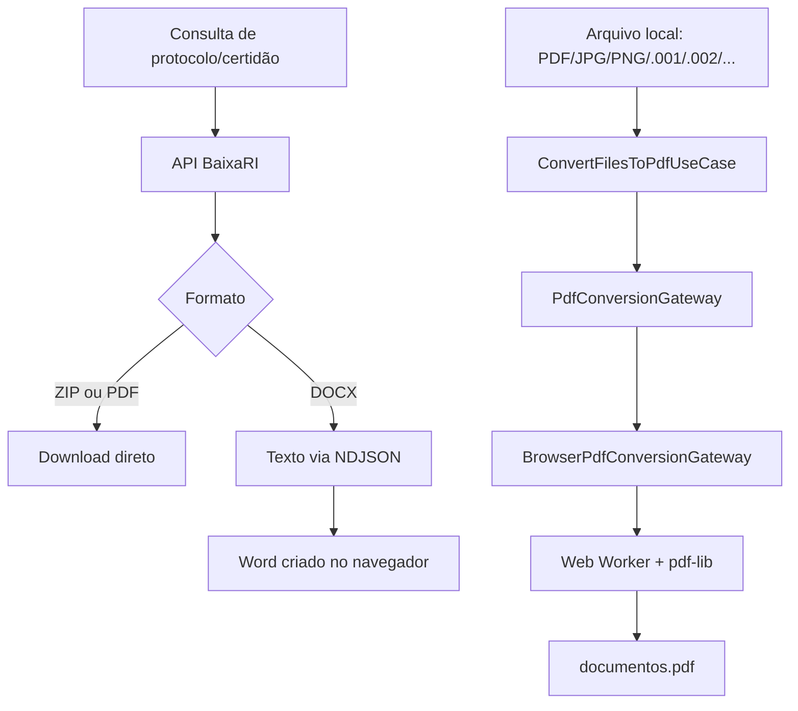

<div align="center">

# BaixaRI

Interface web para localizar protocolos e certidões nos formatos ZIP, PDF ou DOCX e converter arquivos locais em um PDF único diretamente no navegador.


[Backend](https://github.com/marcosfrancomarinho/baixari-backend) · [Funcionalidades](#funcionalidades) · [Execução](#instalação-e-execução)

</div>

## Sobre o projeto

O **BaixaRI** simplifica a consulta e o download de documentos organizados por número. O usuário informa o número, escolhe entre **protocolo** e **certidão** e seleciona o formato desejado.

ZIP e PDF de protocolos/certidões são recebidos prontos da API. Para DOCX, o frontend acompanha a extração de cada página em tempo real e cria o Word no navegador.

Na aba **Converter para PDF**, arquivos PDF, JPG, JPEG e PNG são processados inteiramente no navegador. Arquivos com extensões numéricas como `.001`, `.002` e `.003` também são aceitos quando a assinatura interna identifica uma imagem válida. Eles não são enviados ao backend.

## Funcionalidades

- consulta por número de protocolo ou certidão;
- saída em ZIP, PDF ou DOCX;
- consumo progressivo de NDJSON para geração de DOCX;
- criação de Word no navegador com `docx`;
- seleção, reordenação e remoção de vários arquivos;
- união de PDFs no navegador com `pdf-lib`;
- conversão de JPG/JPEG/PNG para PDF mesmo quando a extensão é `.001`, `.002`, `.003` ou outra;
- identificação do formato pelo conteúdo real do arquivo;
- normalização de imagens com fundo branco, limite de 40 MP, lado máximo de 3000 px e até 8 MP no canvas de trabalho;
- processamento sequencial em Web Worker para reduzir o pico de memória e manter a interface responsiva;
- progresso percentual por arquivo e cancelamento imediato encerrando o Worker;
- nenhum upload ao servidor durante a conversão de arquivos locais;
- interface responsiva com Tailwind CSS.

## Fluxo



## Conversão local para PDF

A conversão não usa `VITE_API_URL` e não chama uma rota de upload.

1. A apresentação chama apenas o `ConvertFilesToPdfUseCase`.
2. O caso de uso depende do contrato `PdfConversionGateway`, seguindo inversão de dependência.
3. O adapter `BrowserPdfConversionGateway` executa a implementação concreta em um Web Worker.
4. O Worker identifica PDF, PNG ou JPEG pela assinatura interna, sem depender da extensão.
5. PDFs são processados um por vez; imagens têm as dimensões lidas antes da decodificação e são redimensionadas antes do canvas sempre que possível.
6. O `pdf-lib` monta o PDF respeitando a ordem escolhida.
7. O navegador inicia o download de `documentos.pdf`.

Para conter o uso de memória, cada arquivo é processado sequencialmente, bitmaps são fechados após o uso, o canvas é liberado a cada imagem e o Worker é encerrado ao concluir ou cancelar. O caso de uso limita cada arquivo a 256 MiB e o conjunto a 512 MiB. Imagens acima de 40 milhões de pixels são recusadas e o canvas de trabalho fica limitado a aproximadamente 8 milhões de pixels.

## Tecnologias

- **React 19**
- **TypeScript 6**
- **Vite 8**
- **Tailwind CSS 4**
- **docx**
- **pdf-lib**
- **Fetch API + Streams**
- **ESLint**

## Estrutura

```text
src/
├── componets/
│   ├── Alert.tsx
│   ├── ConvertForm.tsx
│   ├── DownloadForm.tsx
│   ├── Footer.tsx
│   └── Header.tsx
├── di/
│   └── pdf-converter.ts
├── modules/
│   └── pdf-converter/
│       ├── application/
│       │   ├── contracts/
│       │   │   └── pdf-conversion.gateway.ts
│       │   ├── model/
│       │   │   └── pdf-conversion.ts
│       │   └── usecases/
│       │       └── convert-files-to-pdf.usecase.ts
│       └── infra/
│           └── browser/
│               ├── browser-pdf-conversion.gateway.ts
│               ├── document.signature.ts
│               └── pdf.converter.worker.ts
├── styles/
│   └── index.css
├── App.tsx
└── main.tsx
```

## Configuração

Informe a URL do backend em `.env.local`:

```env
VITE_API_URL=http://localhost:3000
```

Essa URL é usada somente nas consultas e na extração de texto de protocolos/certidões. A aba de conversão de arquivos locais funciona sem enviar os documentos ao backend.

## Instalação e execução

### Requisitos

- Node.js 22 ou superior;
- npm ou Yarn;
- BaixaRI Backend para as funcionalidades de consulta.

```bash
git clone https://github.com/marcosfrancomarinho/baixari.git
cd baixari
npm install
npm run dev
```

## Scripts

| Comando | Descrição |
|---|---|
| `npm run dev` | inicia o servidor de desenvolvimento |
| `npm run build` | verifica tipos e gera o build |
| `npm run lint` | executa o ESLint |
| `npm run preview` | visualiza o build |

## Autor

Desenvolvido por [Marcos Marinho](https://github.com/marcosfrancomarinho).
