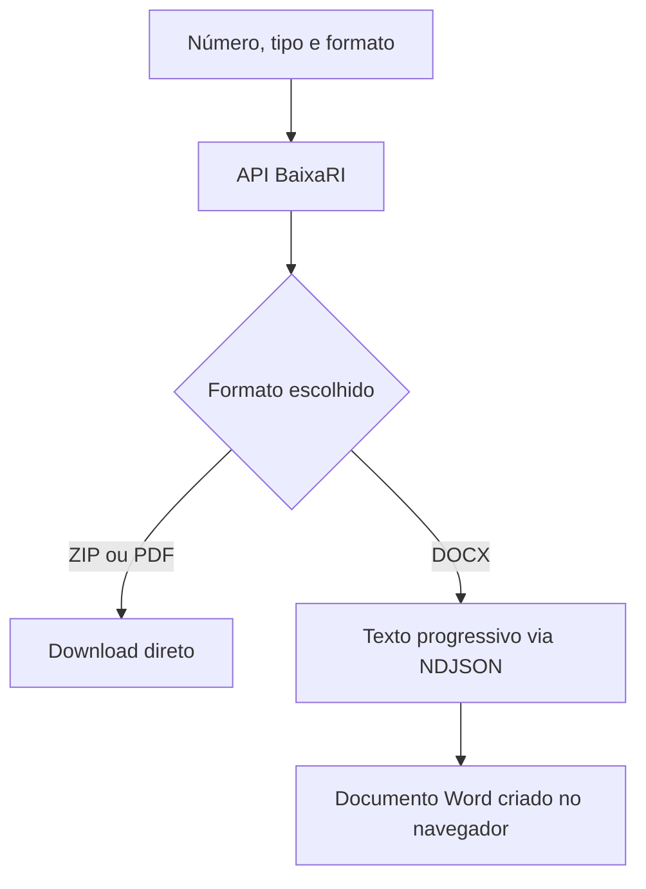

<div align="center">

# BaixaRI

Interface web para localizar protocolos e certidões nos formatos ZIP, PDF ou DOCX e converter arquivos enviados em um PDF único.


[Backend](https://github.com/marcosfrancomarinho/baixari-backend) · [Funcionalidades](#funcionalidades) · [Execução](#instalação-e-execução)

</div>

## Sobre o projeto

O **BaixaRI** simplifica a consulta e o download de documentos organizados por número. O usuário informa o número, escolhe entre **protocolo** e **certidão** e seleciona o formato desejado.

ZIP e PDF são recebidos prontos da API. Para DOCX, o frontend acompanha a extração de cada página em tempo real e cria o arquivo Word diretamente no navegador, sem repetir o processamento no backend.

Na aba **Converter para PDF**, selecione arquivos PDF, JPG, JPEG ou PNG, ajuste a ordem e gere um PDF único. O navegador envia os arquivos como `multipart/form-data` no campo `files` para `POST /documents/convert/pdf`. A API processa os arquivos e devolve `documentos.pdf`.

## Funcionalidades

- consulta por número de protocolo ou certidão;
- seleção de saída em ZIP, PDF ou DOCX;
- download direto de ZIP e PDF;
- consumo progressivo de eventos NDJSON para geração do DOCX;
- criação do Word no navegador com a biblioteca `docx`;
- organização do DOCX por arquivo e página;
- acompanhamento do arquivo e da página em processamento;
- cancelamento da extração com `AbortController`;
- leitura do nome de arquivo enviado em `Content-Disposition`;
- mensagens claras de sucesso, cancelamento e erro;
- envio do formulário pela tecla `Enter`;
- interface responsiva construída com Tailwind CSS.
- seleção de vários PDFs e imagens, com reordenação e remoção antes do envio;
- cancelamento da conversão e exibição de erros retornados pela API.

## Fluxo



## Como o DOCX é gerado

1. O frontend chama `/protocol/:number/text` ou `/certificate/:number/text`.
2. O backend envia um evento para cada página processada.
3. A interface atualiza o progresso conforme os eventos chegam.
4. Ao receber `done`, a biblioteca `docx` monta o arquivo Word.
5. O navegador inicia o download como `protocolo_<número>.docx` ou `certidao_<número>.docx`.

Se a extração for cancelada, a conexão é encerrada e o backend interrompe o fluxo com segurança.

## Tecnologias

- **React 19** — componentes e estado da interface;
- **TypeScript 6** — tipagem estática;
- **Vite 8** — servidor de desenvolvimento e build;
- **Tailwind CSS 4** — estilização;
- **docx** — criação do documento Word no navegador;
- **Fetch API + Streams** — leitura progressiva de NDJSON;
- **ESLint** — análise estática do código.

## Estrutura

```text
src/
├── componets/
│   ├── Alert.tsx          # mensagens de retorno
│   ├── ConvertForm.tsx    # upload e conversão para PDF
│   ├── DownloadForm.tsx   # formulário, downloads e DOCX
│   ├── Footer.tsx
│   └── Header.tsx
├── styles/
│   └── index.css          # entrada do Tailwind CSS
├── App.tsx
└── main.tsx
```

## Configuração

Informe a URL do backend em um arquivo `.env.local`:

```env
VITE_API_URL=http://localhost:3000
```

Sem essa variável, a aplicação usa `http://localhost:3000`.

O backend precisa expor as rotas de download e extração e `POST /documents/convert/pdf`, descritas no repositório [baixari-backend](https://github.com/marcosfrancomarinho/baixari-backend). A conversão depende de Ghostscript instalado e acessível no servidor. O limite padrão é 50 MiB por arquivo e uma conversão simultânea por processo; essas opções podem ser configuradas no backend. O navegador precisa alcançar a URL definida em `VITE_API_URL`.

## Instalação e execução

### Requisitos

- Node.js 22 ou superior;
- npm ou Yarn;
- BaixaRI Backend em execução.

```bash
git clone https://github.com/marcosfrancomarinho/baixari.git
cd baixari
npm install
npm run dev
```

O Vite exibirá o endereço local da aplicação no terminal.

### Scripts

| Comando | Descrição |
|---|---|
| `npm run dev` | inicia o servidor de desenvolvimento |
| `npm run build` | verifica os tipos e gera o build de produção |
| `npm run lint` | executa o ESLint |
| `npm run preview` | visualiza localmente o build gerado |

## Build de produção

```bash
npm run build
npm run preview
```

Os arquivos finais são gerados em `dist/`.

## Autor

Desenvolvido por [Marcos Marinho](https://github.com/marcosfrancomarinho).
